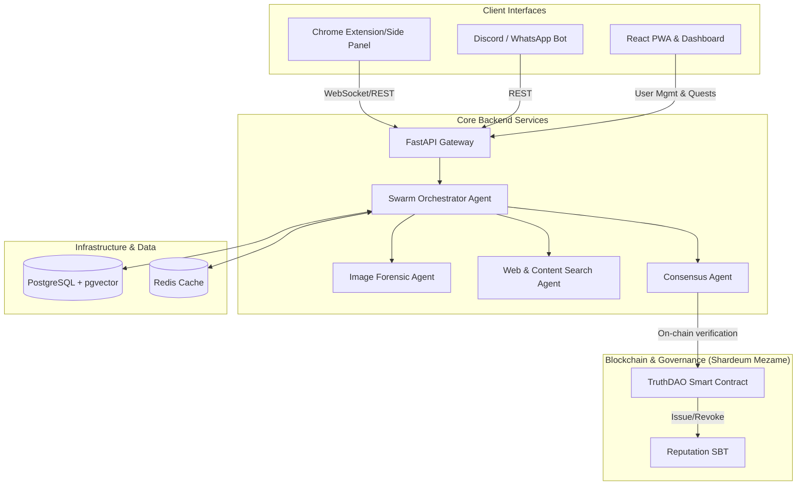

# TruthLens

**Fake News Detection Assistant Ecosystem**

TruthLens is a decentralized, AI-powered system designed to combat misinformation through advanced forensic analysis, swarm intelligence consensus, and a decentralized trust infrastructure. By blending multi-agent LLM systems with Web3 reputation and governance mechanisms (Shardeum), TruthLens provides irrefutable fact-checking directly to end users.

## 🏗️ Architecture Design & Ecosystem

TruthLens operates through a multi-faceted ecosystem:



## 🌟 Key Features

*   **Multi-Agent Swarm Intelligence:** Uses specialized AI agents for image forensics, deep-web research, and consensus to systematically evaluate truth claims.
*   **Decentralized Governance:** Integrated natively with the **Shardeum Mezame** testnet. Users can vote on contested facts and build on-chain reputation via Soulbound Tokens (SBTs).
*   **Browser Extension (Clean Hub):** A sleek Chrome side-panel providing in-context, on-page truth verification, MetaMask integration, and seamless Web3 action flows.
*   **Omnichannel Sentinels:** Discord and WhatsApp bots proactively monitor, verify, and broadcast real-time fact-checks across heavily targeted social communities.
*   **Knowledge Graph Visualizations:** Visual node-edge mappings of sources, citations, and related entities for transparent provenance tracking.

## 🚀 Running Steps

### Prerequisites

*   Node.js (`v18+`)
*   Python (`v3.10+`)
*   Docker & Docker Compose
*   MetaMask (configured for Shardeum Testnet)

### 1. Start Infrastructure Dependencies
TruthLens backend utilizes PostgreSQL (with `pgvector` for semantic search) and Redis for quick caches.
```bash
# In the project root
docker-compose up -d
```

### 2. Configure Environment variables
Set up your `.env` file in the `backend/` and root directories based on provided templates.
Required API Keys: Google Gemini (GenAI), SerpAPI, Firecrawl, and your Web3 Wallet Private Key for deployments.

### 3. Run Backend Services
```bash
cd backend
python -m venv venv
# Windows
venv\Scripts\activate
# Mac/Linux: source venv/bin/activate

pip install -r requirements.txt
python -m uvicorn api.main:app --host 0.0.0.0 --port 8000 --reload
```

### 4. Smart Contracts Build & Deploy (Optional)
Deploy the core DAOs and token infrastructure to Shardeum Mezame testnet:
```bash
npm install # from project root
cd contracts
npx hardhat compile
python scripts/deploy_truthlens.py
```

### 5. Start Frontend & Extension Environments
Run the entire frontend ecosystem concurrently:
```bash
# To run the web dashboard
npm run dev:web

# To run the Chrome Extension
npm run dev:ext
```
*To install the extension, navigate to `chrome://extensions/`, enable "Developer mode", and load the `extension/dist` build folder.*

## 🤝 Community & Governance
TruthLens is governed by its users. Dispute resolutions and knowledge additions are processed on-chain using TruthDAO. All community members are incentivized to maintain high standard reputation scores to influence overall multi-agent consensus weights.
